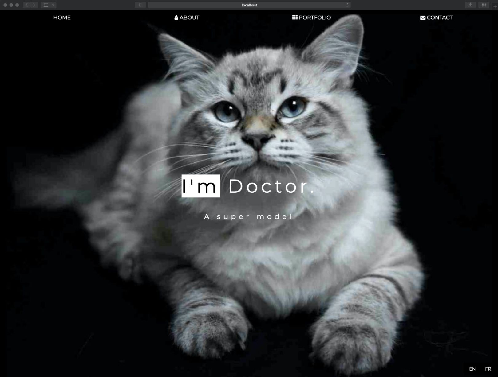

# Cat Model Website

A modern, fully responsive cat model portfolio website built with Vite, React, and TypeScript.

The project includes bilingual support (English/French), smooth scroll navigation, lazy image loading, SEO-friendly metadata, and advanced modal interactions optimized for both desktop and mobile.

All photos were captured and retouched by me, demonstrating both my photography skills and frontend development expertise.

---

## Demo

[](https://yinhsunchang.github.io/cat-model-v2)

---

## Website Sections

Navbar
- Scroll-based appearance
- Responsive hamburger menu (mobile & tablet)

Hero Section
- Parallax background
- Title & subtitle overlay

About
- Personal introduction
- Skill bars
- Small statistics counters
- Pricing / Services
- Testimonials / Client feedback

Portfolio
- Responsive image wall
- Click-to-open image modal
- Original Cat Photography (All photos on this site were taken and retouched by me.)

Contact
- Contact information (address, phone, email)
- Contact form with fake API call to simulate form submission

Footer
- Social media icons
- Copyright information

---

## Features

Internationalization (i18n)
- English / French bilingual support
- Language switching without page reload
- i18n applied to: UI text / Image alt text & captions / Modal content

SEO & Metadata
- Dynamic document title
- Dynamic meta tags for SEO
- Managed with React Helmet

UX & Performance Enhancements
- Smooth scroll navigation for seamless in-page transitions
- Lazy loading images for improved performance
- Fully responsive design (mobile / tablet / desktop)

Advanced Portfolio Modal
- Previous / Next arrows (desktop & mobile)
- Swipe gestures (left / right)
- Keyboard navigation: Left / Right arrow keys, ESC to close
- Multiple close methods: Background click, Close (X) button (With stopPropagation, image click intentionally does not close the modal)
- i18n-enabled image captions & alt text
- Thumbnail strip at the bottom: Horizontal scrolling / Click thumbnail to navigate / Active image highlighted / Swipe scroll supported

---

## Tech Stack

- Frontend: Vite, React, TypeScript  
- Styling: CSS  
- Fonts & Icons: Google Fonts, Font Awesome  
- Internationalization: i18n
- Head Management / SEO: React Helmet

---

## Getting Started

Follow the steps below to run the project locally.

```bash
# 1. Clone the repository
git clone https://github.com/yinhsunchang/cat-model-v2.git
cd cat-model-v2

# 2. Install dependencies
npm install

# 3. Run the development server
npm run dev
```

---

## Possible Improvements

- Photo filters for sorting images by style or category.  
- Integration of a real backend API for the contact form.

---

## License, Copyright & Credits

- Code License: MIT License © Yin-Hsun Chang. See the [LICENSE](LICENSE) file for details.
- Images & Media: © Yin-Hsun Chang. All images and media files are not covered by the MIT License and may not be used without permission.
- Third-Party Resources: This project uses third-party resources, which are subject to their respective licenses. Examples include: Google Fonts, Font Awesome
- Design Reference: Inspired by the W3Schools "Parallax" and "Dark Portfolio" templates.
