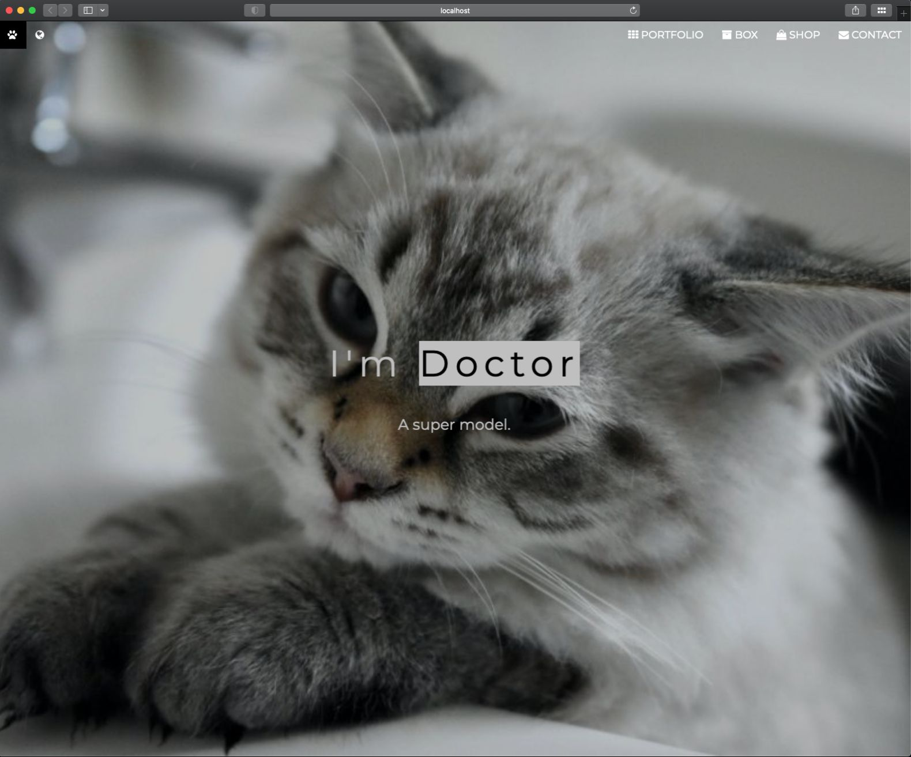
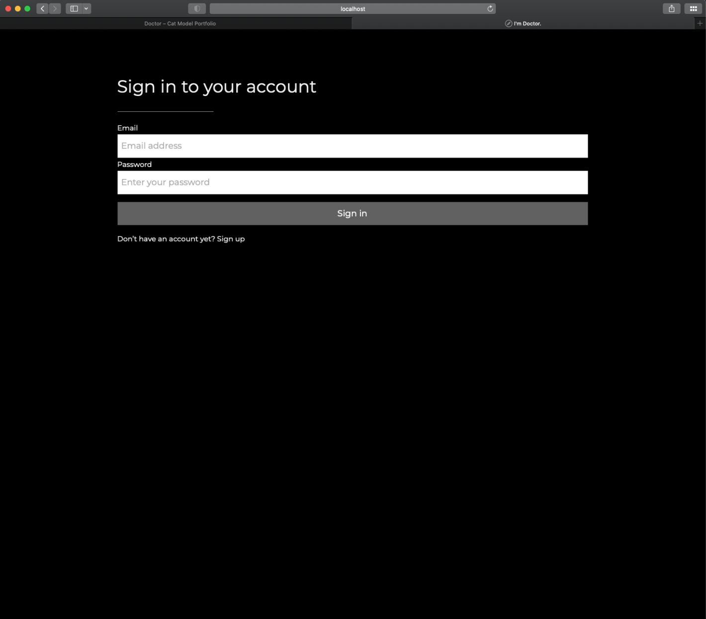

# Cat Model Website

A stylish multi-page React application built as a portfolio website for my cat.

Originally developed as a single-page application, the project gradually evolved into a larger React application with multiple pages, client-side routing, reusable components, state management, authentication, backend integration, testing, and CI/CD.

Rather than rebuilding the project from scratch, I continuously evolved and maintained the existing codebase as new features and requirements were introduced. This involved restructuring the application, improving component organization, introducing shared state and services, adding automated tests, and establishing a deployment workflow.

The project reflects my approach to building and improving maintainable React applications over time, with a focus on clean architecture, usability, testability, and continuous improvement.

---

## Demo

### Public Website:

[](https://yinhsunchang.github.io/cat-model-v2)

### Authenticated Dashboard:

[](https://yinhsunchang.github.io/cat-model-v2/signin)

Demo Account:

- Email: demo.admin@catmodel.com
- Password: demo!admin

Backend Repository: [Cat Model Backend](https://github.com/yinhsunchang/cat-model-backend)

---

## Website Sections

### Public Website

- About page
- Portfolio gallery
- Cat Box
  - Cat Encyclopedia
  - Cat Movie List
- Shop Landing Page
- Contact page
- 404 / Not Found page

### Authentication

- Sign Up
- Sign In

### Authenticated Dashboard

- Dashboard
- Subscribers
- Messages
- Reservations
- Todos

---

## Main Features

### Navbar

- Scroll-based appearance
- Responsive hamburger menu

### Hero Section

- Parallax background
- Title & subtitle overlay

### About

- Personal introduction
- Skill bars
- Small statistics counters
- Pricing / Services
- Testimonials / Client feedback

### Portfolio

- Responsive image wall
- Click-to-open image modal

### Cat Box

- Cat Encyclopedia
- Movie List with Zustand state management and persistence

### Shop

- Landing page prepared for a future online shop.
- Email subscription form for launch notifications
- Repository: [Coming Soon](https://github.com/yinhsunchang/coming-soon)

### Contact

- Contact information (address, phone, email)
- Contact Form with basic validation and Supabase integration for message storage

### Footer

- Social media icons
- Copyright information

### Authentication

- Sign Up / Sign In / Sign Out

### Dashboard

A private administration area for managing:

- Subscribers
- Contact messages
- Reservations
- Todos

Subscribers, contact messages, and reservations are managed directly through Supabase, while Todos are handled through the Express REST API.

---

## Tech Stack

- Frontend: Vite, React, TypeScript, Zustand, React Router
- Backend: Node.js/Express, Restful API
- Database: Supabase
- Styling: CSS
- UI & Animation: Framer Motion, Swiper, React CountUp
- Fonts & Icons: Google Fonts, Font Awesome
- Internationalization: react-i18next
- Head Management/SEO: React Helmet Async
- Testing: Vitest, React Testing Library
- Deployment: GitHub Actions (CI/CD), GitHub Pages (Frontend), Render (Backend)

---

## Architecture

```bash
src
├── pages/
│   ├── about/
│   │   ├── About.tsx
│   │   ├── PageAbout.tsx
│   │   ├── HeaderAbout.tsx
│   │   ├── SkillBar.tsx
│   │   ├── SkillBar.test.tsx
│   │   ├── StatCard.tsx
│   │   ├── StatCard.test.tsx
│   │   ├── PriceCard.tsx
│   │   ├── PriceCard.test.tsx
│   │   ├── Modal.tsx
│   │   ├── Modal.test.tsx
│   │   ├── Reservation.tsx
│   │   ├── Reservation.test.tsx
│   │   ├── ReservationForm.tsx
│   │   ├── ReservationForm.test.tsx
│   │   ├── Reputation.tsx
│   │   └── Reputation.test.tsx
│   │
│   ├── portfolio/
│   ├── box/
│   ├── shop/
│   ├── contact/
│   ├── signup/
│   ├── signin/
│   ├── dashboard/
│   ├── subscribers/
│   ├── messages/
│   ├── reservations/
│   ├── todos/
│   └── 404/
│
├── assets
├── auth
├── i18n
├── lib
├── layouts
├── routes
├── services
├── stores
├── types
├── App.css
├── App.tsx
├── main.css
└── main.tsx
```

---

## Getting Started

Follow the steps below to run the project locally.

```bash
# 1. Clone the repository
git clone https://github.com/yinhsunchang/cat-model-v2.git
cd cat-model-v2

# 2. Install dependencies
npm install

# 3. Run the development server
npm run dev
```

---

## Possible Improvements

- Expand Shop into a small e-commerce application
- Add more admin features
- Improve accessibility
- Optimize performance
- Photo filters for sorting images by style or category.

---

## License, Copyright & Credits

- Code License: MIT License © Yin-Hsun Chang. See the [LICENSE](LICENSE) file for details.
- Images & Media: © Yin-Hsun Chang. All images and media files are not covered by the MIT License and may not be used without permission.
- Third-Party Resources: This project uses third-party resources, which are subject to their respective licenses.
- Design Reference: Inspired by the W3Schools "Parallax" and "Dark Portfolio" templates.
